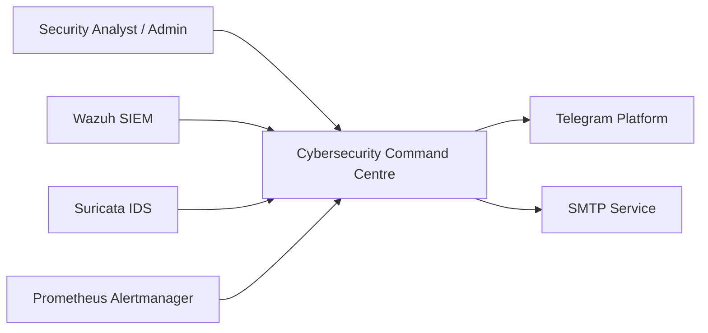
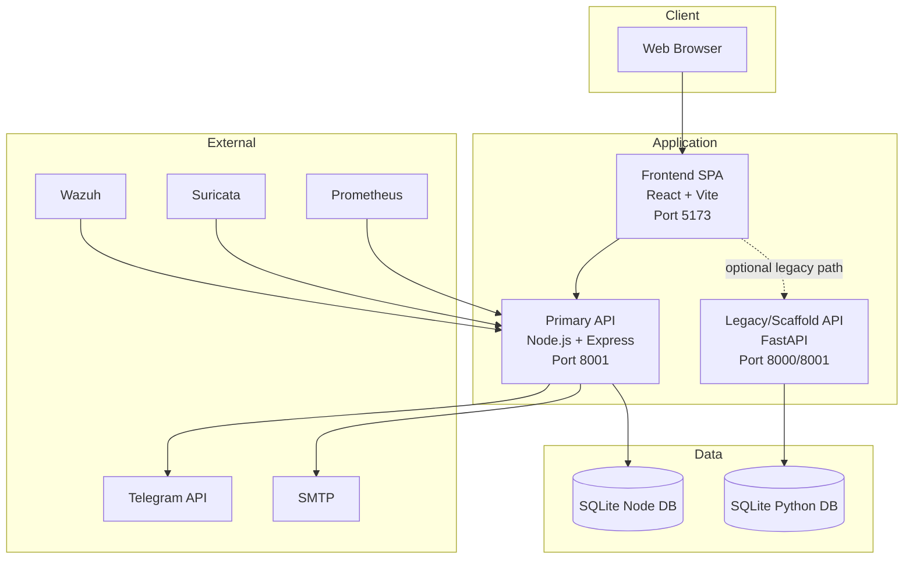
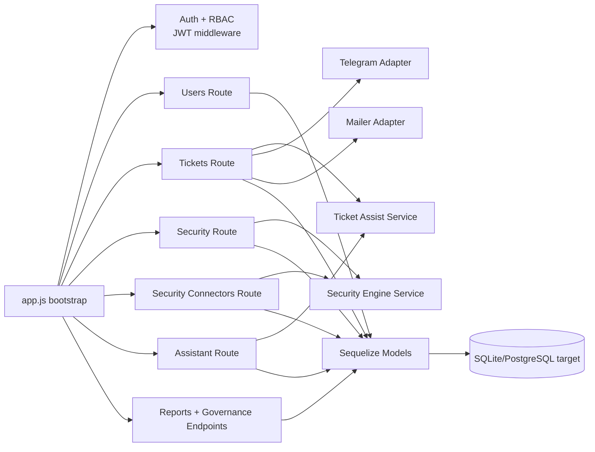

# Cybersecurity Command Centre: C4 Architecture

## C1: System Context

System purpose:
- ingest security signals
- coordinate incident response
- provide dashboards, ticketing, and reporting

## C2: Container View

Container responsibilities:

Frontend SPA:
- dashboard rendering
- token/session handling
- API orchestration for tickets, findings, reports

Node API (primary):
- authn/authz, incident/ticket workflows
- security findings ingestion
- automation jobs and reporting
- notifications and governance logs

FastAPI (secondary):
- scaffold API, webhook and SSE functions
- narrower endpoint surface than Node API

## C3: Component View (Node API)

Key component details:

Auth and RBAC:
- bearer JWT validation
- role enforcement for admin-only operations

Tickets:
- lifecycle transitions (identified to closed)
- SLA and impact metadata
- comments, action-items, history, resolution reports

Security:
- findings, asset health, executive impact, threat intel views
- network and database monitoring APIs

Connectors:
- receives Wazuh/Suricata/Prometheus payloads
- signature/secret validation, replay protection, dead-letter handling

Assistant:
- command-centre summaries
- triage/ticket/alert analysis recommendations

## C4: Code/Module Mapping

Frontend modules:
- api client: frontend/src/api.js
- application shell: frontend/src/App.jsx
- styling/theme: frontend/src/App.css

Node backend modules:
- bootstrap + wiring: node-backend/src/app.js
- domain routes: node-backend/src/routes/*.js
- ingestion service: node-backend/src/services/securityEngine.js
- model bootstrap: node-backend/src/models/index.js
- integration adapters: node-backend/src/telegram.js, node-backend/src/mailer.js

Python backend modules:
- API root: backend/app/main.py
- auth/data services: backend/app/auth.py, backend/app/crud.py

## Cross-Cutting Concerns

Security:
- helmet, express-rate-limit, CORS policy, validator/sanitizer

Observability:
- request logs via morgan
- audit logs persisted in DB

Reliability:
- dead-letter queue for failed connector ingests
- scheduled automation routines for recurring security checks

## Architectural Constraints

- Dual backend introduces routing ambiguity if ports are misaligned.
- SQLite is suitable for local/dev but not ideal for HA production workloads.
- Connector replay and rate-limit state currently local-process scoped.

## Suggested C4 Evolution

1. Remove ambiguity by assigning one production API boundary.
2. Promote shared services (DB, Redis, observability) as first-class containers.
3. Add API gateway/WAF and identity provider container in production C2 diagram.
