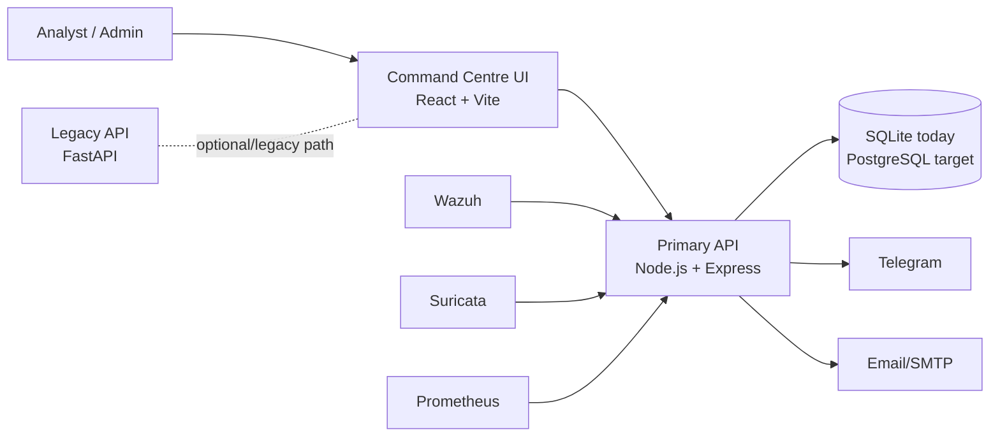

# Cybersecurity Command Centre: Executive Architecture Summary

## What This Platform Does

The Cybersecurity Command Centre is an operations platform that helps security and IT teams:

- detect and triage cyber threats
- manage incident tickets across their full lifecycle
- coordinate response actions and ownership
- produce executive and technical reporting
- integrate external security telemetry (Wazuh, Suricata, Prometheus)

## Business Outcomes

- Faster incident response through guided ticket workflows and assistant recommendations
- Better visibility across applications, networks, and database assets
- Improved accountability through audit logs and role-based controls
- Reduced operational risk via automated scanning and ticket creation from findings

## Current Operating Model

## Strategic Architecture Position

Today:
- Frontend and Node backend power the command-centre experience
- FastAPI backend remains available as legacy/scaffold service
- SQLite supports local/dev operation

Target:
- Single canonical production API path
- Managed relational database (PostgreSQL)
- Containerized deployment with centralized observability and secret management

## Security and Governance Posture

Implemented controls:
- JWT authentication and role-based authorization (admin/analyst)
- Input validation and sanitization across API boundaries
- API rate limiting and secure headers
- Connector authentication and replay protection for external ingestion
- Persistent audit logging for governance-relevant actions

Recommended hardening priorities:
- Consolidate to one production API contract
- Move to managed database and formal migrations
- Add centralized SIEM/monitoring pipelines
- Externalize rate-limit/replay state to Redis for scale

## Core Technology Stack

Frontend:
- React 18, Vite 5, Vitest

Primary backend:
- Node.js, Express, Sequelize, SQLite (current), JWT, cron, SMTP, Telegram

Secondary backend:
- FastAPI, SQLAlchemy, APScheduler, SSE

DevOps:
- Docker Compose, Helm scaffold, environment-driven configuration

## Key Risks and Mitigations

Risk 1: Dual-backend ambiguity can cause route mismatches
- Mitigation: enforce a single active API gateway path in production

Risk 2: SQLite limits scale and high availability
- Mitigation: migrate to PostgreSQL with backup/restore runbooks

Risk 3: Connector volume growth and replay control at scale
- Mitigation: move replay/ratelimit state to Redis and monitor dead-letter queue

## 90-Day Architecture Plan

1. Standardize runtime on Node API + frontend with explicit environment routing.
2. Implement PostgreSQL migration and CI/CD migration gates.
3. Add production-grade observability (metrics, logs, alerting).
4. Extend Helm manifests to deploy full stack with secrets and ingress.
5. Add contract tests to ensure frontend/backend endpoint compatibility.

## Summary

The platform already delivers strong incident-management and security-operations capability. The highest-value next step is production consolidation: one API contract, managed data services, and cloud-native observability/security controls.
