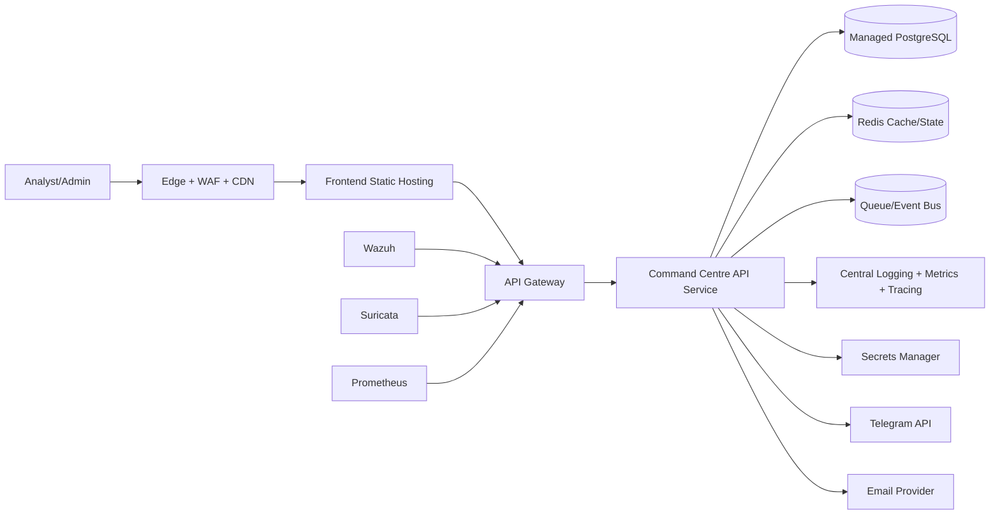
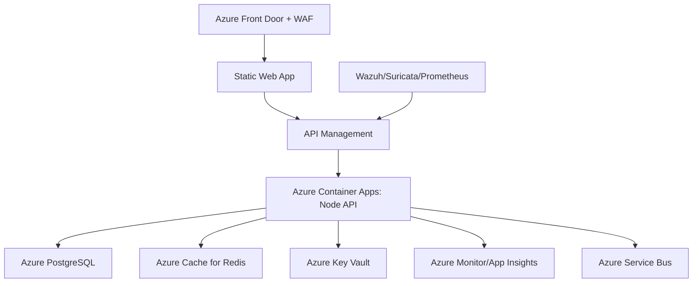
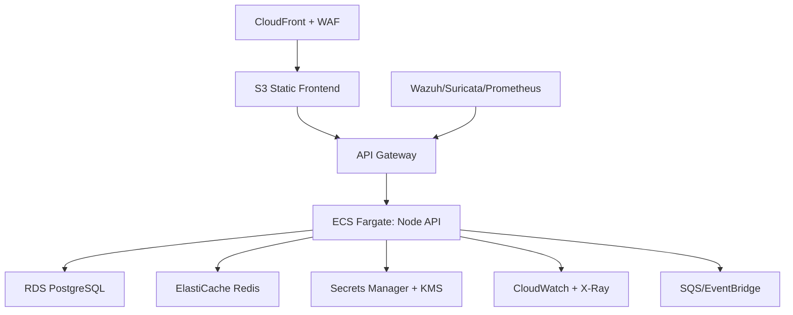

# Cybersecurity Command Centre: Cloud Target-State Architecture (Azure and AWS)

## 1. Target-State Principles

- One canonical API surface for the frontend
- Managed data services for reliability and scale
- Zero hardcoded secrets (vault-managed identity)
- Observable-by-default platform with centralized security telemetry
- IaC-driven repeatable environments (dev, test, prod)

## 2. Target Reference (Cloud-Agnostic)

## 3. Azure Target Architecture

### 3.1 Services Mapping

Frontend and edge:
- Azure Front Door (WAF/CDN/TLS)
- Azure Static Web Apps or Azure Storage Static Website

API and compute:
- Azure Container Apps or AKS for Node API
- Optional dedicated worker container for scheduled jobs

Data and state:
- Azure Database for PostgreSQL (Flexible Server)
- Azure Cache for Redis
- Optional Azure Service Bus for async workflows

Security and secrets:
- Azure Key Vault for app secrets and connector keys
- Managed Identity for service-to-service auth
- Microsoft Defender for Cloud + Sentinel integration

Observability:
- Azure Monitor + Log Analytics + Application Insights

### 3.2 Azure Logical Diagram

### 3.3 Azure Deployment Notes

- Use private endpoints for PostgreSQL, Redis, and Key Vault
- Enforce TLS 1.2+ and strict inbound connector rules through APIM policies
- Use DCR-based logging and alert rules for failed login spikes and connector dead-letter growth

## 4. AWS Target Architecture

### 4.1 Services Mapping

Frontend and edge:
- CloudFront + AWS WAF + ACM
- S3 static hosting for frontend assets

API and compute:
- ECS Fargate or EKS for Node API
- Optional ECS scheduled tasks (or EventBridge Scheduler + worker)

Data and state:
- Amazon RDS for PostgreSQL
- ElastiCache for Redis
- SQS/SNS or EventBridge for asynchronous processing

Security and secrets:
- AWS Secrets Manager + KMS
- IAM roles for task execution and least-privilege access
- GuardDuty/Security Hub integration

Observability:
- CloudWatch Logs/Metrics/Alarms + AWS X-Ray/OpenTelemetry

### 4.2 AWS Logical Diagram

### 4.3 AWS Deployment Notes

- Use private subnets for API, DB, Redis
- Restrict connector ingress via API Gateway resource policies and WAF rules
- Enable cross-region automated backups and disaster recovery runbook

## 5. Reference Runtime Segmentation

Public zone:
- CDN/WAF, static frontend, API gateway endpoints

Private application zone:
- API containers, worker containers

Private data zone:
- PostgreSQL, Redis, queue backplanes

Management zone:
- CI/CD, artifact registry, IaC state, monitoring control plane

## 6. Target Security Baseline

Authentication and authorization:
- Continue JWT RBAC or integrate enterprise IdP (OIDC/SAML)

API protection:
- WAF, bot control, schema validation, rate limits, connector signatures

Data protection:
- Encryption at rest and in transit
- Secret rotation policy and short-lived credentials

Operational security:
- Immutable container images with SCA/SAST/DAST in CI
- Centralized audit trail and incident alerting to SOC

## 7. Migration Path from Current State

Phase 1: Stabilize runtime
1. Promote Node API as canonical command-centre API.
2. Add Node service to docker-compose and helm chart.
3. Freeze frontend API contract and add contract tests.

Phase 2: Data and platform
1. Move from SQLite to PostgreSQL.
2. Introduce Redis for replay/rate-limit state.
3. Add queue-backed async ingestion for connectors.

Phase 3: Cloud hardening
1. Deploy through IaC (Bicep/Terraform/CloudFormation).
2. Add managed secrets, observability, and WAF policy sets.
3. Run game days for incident response and DR drills.

## 8. Non-Functional Targets (Suggested)

- Availability: 99.9%+
- API p95 latency: < 300 ms for read endpoints
- RPO: <= 15 minutes, RTO: <= 1 hour
- Security telemetry MTTA reduction target: 30% over baseline

## 9. Suggested CI/CD Architecture

- Build and test frontend and backend artifacts independently
- Security scans in pipeline (dependency and container scanning)
- Promote images through environments with signed artifacts
- Run DB migrations as controlled deployment stage
- Post-deploy synthetic checks for key APIs and login path

## 10. Decision Guidance: Azure vs AWS

Choose Azure first when:
- Existing Microsoft security ecosystem, Sentinel, Entra integration are strategic

Choose AWS first when:
- Team has mature ECS/EKS and CloudWatch/Security Hub operating patterns

Both platforms support equivalent target-state quality if governance, observability, and secret hygiene are consistently implemented.
